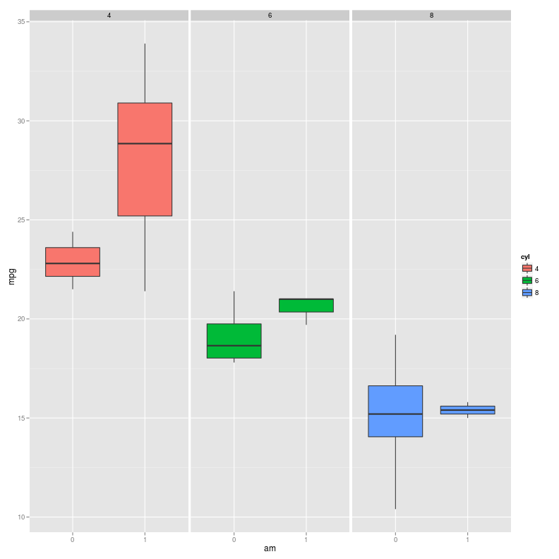
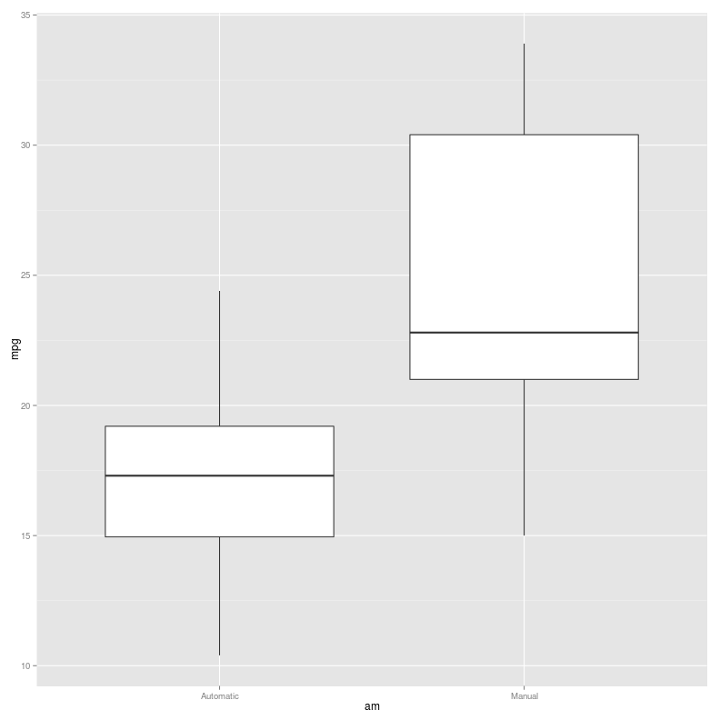
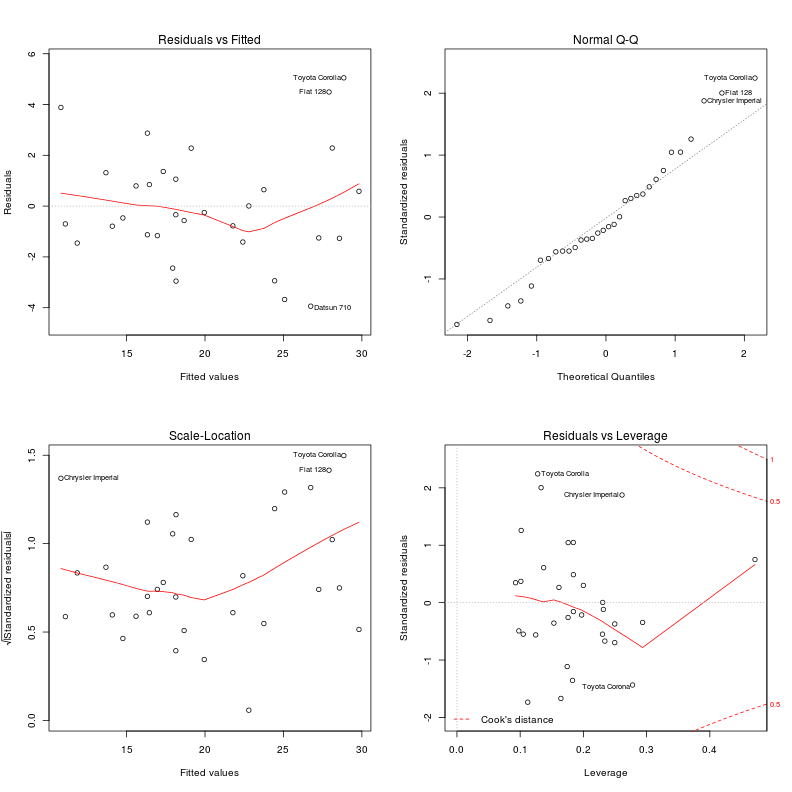

# MTCARS

You work for Motor Trend, a magazine about the automobile industry. Looking at a data set of a collection of cars, they are interested in exploring the relationship between a set of variables and miles per gallon (MPG) (outcome). They are particularly interested in the following two questions:


1. "Is an automatic or manual transmission better for MPG"
2. "Quantify the MPG difference between automatic and manual transmissions"

------------

### Executive Summary

Transmission is highly coorrelated but amount of cylinders plays a much more important role in the cars MPGs.
Manual cars have higher MPG on average but this is not always the case.


```r
ggplot(mtcars, aes(x=am, y=mpg, fill=cyl)) + geom_boxplot() + facet_grid(. ~ cyl)
```

 


### Preparing the Dataset

To prepare the data, I transformed some variables into factors.


```r
data(mtcars)
mtcars$am <- factor(mtcars$am)
mtcars$cyl <- factor(mtcars$cyl)
mtcars$gear <- factor(mtcars$gear)
mtcars$carb <- factor(mtcars$carb)
```

### Exploring the Dataset

Lets look at AM vs MPG.

```r
ggplot(mtcars, aes(am, mpg)) + geom_boxplot() + scale_x_discrete(labels=c('Automatic', 'Manual'))
```

 
On average, a manual car (AM = 1) will have higher MPG. However we cannot conclude that automatic is better for MPG because we haven't looked at how the other variables interact.

Lets look at the other variables.

```r
pairs(mtcars)
```

 
From this it is obvious that other variables such as cyl, disp, hp, wt, vs, gear and carb are also related to MPG.
We must study these interactions to reach a more robust conclusion.
### Fitting a Model

Lets use the noob canon and just try to fit a model with all the variables.

```r
fit <- lm(mpg ~ . ,data=mtcars)
summary(fit)
```

```
## 
## Call:
## lm(formula = mpg ~ ., data = mtcars)
## 
## Residuals:
##    Min     1Q Median     3Q    Max 
## -3.509 -1.358 -0.095  0.775  4.625 
## 
## Coefficients:
##             Estimate Std. Error t value Pr(>|t|)  
## (Intercept)  23.8791    20.0658    1.19    0.253  
## cyl6         -2.6487     3.0409   -0.87    0.397  
## cyl8         -0.3362     7.1595   -0.05    0.963  
## disp          0.0355     0.0319    1.11    0.283  
## hp           -0.0705     0.0394   -1.79    0.094 .
## drat          1.1828     2.4835    0.48    0.641  
## wt           -4.5298     2.5387   -1.78    0.095 .
## qsec          0.3678     0.9354    0.39    0.700  
## vs            1.9309     2.8713    0.67    0.512  
## am1           1.2121     3.2135    0.38    0.711  
## gear4         1.1144     3.7995    0.29    0.773  
## gear5         2.5284     3.7364    0.68    0.509  
## carb2        -0.9794     2.3180   -0.42    0.679  
## carb3         2.9996     4.2935    0.70    0.495  
## carb4         1.0914     4.4496    0.25    0.810  
## carb6         4.4776     6.3841    0.70    0.494  
## carb8         7.2504     8.3606    0.87    0.399  
## ---
## Signif. codes:  0 '***' 0.001 '**' 0.01 '*' 0.05 '.' 0.1 ' ' 1
## 
## Residual standard error: 2.83 on 15 degrees of freedom
## Multiple R-squared:  0.893,	Adjusted R-squared:  0.779 
## F-statistic: 7.83 on 16 and 15 DF,  p-value: 0.000124
```

From this it seems that cyl4 (intercept) is the most important.
Lets use R to find out the most important variables for this model.


```r
new <- step(fit, direction='both')
```

```r
summary(new)
```

```
## 
## Call:
## lm(formula = mpg ~ cyl + hp + wt + am, data = mtcars)
## 
## Residuals:
##    Min     1Q Median     3Q    Max 
## -3.939 -1.256 -0.401  1.125  5.051 
## 
## Coefficients:
##             Estimate Std. Error t value Pr(>|t|)    
## (Intercept)  33.7083     2.6049   12.94  7.7e-13 ***
## cyl6         -3.0313     1.4073   -2.15   0.0407 *  
## cyl8         -2.1637     2.2843   -0.95   0.3523    
## hp           -0.0321     0.0137   -2.35   0.0269 *  
## wt           -2.4968     0.8856   -2.82   0.0091 ** 
## am1           1.8092     1.3963    1.30   0.2065    
## ---
## Signif. codes:  0 '***' 0.001 '**' 0.01 '*' 0.05 '.' 0.1 ' ' 1
## 
## Residual standard error: 2.41 on 26 degrees of freedom
## Multiple R-squared:  0.866,	Adjusted R-squared:  0.84 
## F-statistic: 33.6 on 5 and 26 DF,  p-value: 1.51e-10
```
Now we know that the best model uses cyl + hp + wt + am.
First we want to know how accurate this is.
Lets look at the residuals


```r
par(mfrow=c(2, 2))
plot(new_fit)
```

 


### Quantification

The model seems legit. Now lets look at this model to determine a few things.

```r
new_fit <- lm(formula = mpg ~ cyl + hp + wt + am - 1, data = mtcars)
summary(new_fit)
```

```
## 
## Call:
## lm(formula = mpg ~ cyl + hp + wt + am - 1, data = mtcars)
## 
## Residuals:
##    Min     1Q Median     3Q    Max 
## -3.939 -1.256 -0.401  1.125  5.051 
## 
## Coefficients:
##      Estimate Std. Error t value Pr(>|t|)    
## cyl4  33.7083     2.6049   12.94  7.7e-13 ***
## cyl6  30.6770     3.1083    9.87  2.8e-10 ***
## cyl8  31.5446     3.8846    8.12  1.3e-08 ***
## hp    -0.0321     0.0137   -2.35   0.0269 *  
## wt    -2.4968     0.8856   -2.82   0.0091 ** 
## am1    1.8092     1.3963    1.30   0.2065    
## ---
## Signif. codes:  0 '***' 0.001 '**' 0.01 '*' 0.05 '.' 0.1 ' ' 1
## 
## Residual standard error: 2.41 on 26 degrees of freedom
## Multiple R-squared:  0.989,	Adjusted R-squared:  0.987 
## F-statistic:  399 on 6 and 26 DF,  p-value: <2e-16
```

From this we can conclude that using manual instead of automatic increases your MPG by about 1.80.
However, the most important factor is cyl. Changing from 4 to 6 cylinders will reduce your MPG by about 3.
